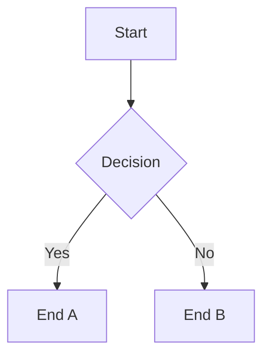

# Obsidian Syntax Reference

Detailed syntax reference for Obsidian Flavored Markdown constructs beyond
the basics covered in SKILL.md. Read this before working with embeds, block
references, Mermaid diagrams, or advanced wikilink patterns.

---

## Embeds

```markdown
![[Note Name]]                   Embed full note
![[Note Name#Heading]]           Embed from heading
![[Note Name#^block-id]]         Embed a specific block
![[image.png]]                   Embed an image
![[image.png|300]]               Image with pixel width
![[image.png|300x200]]           Image with width and height
![[document.pdf]]                Embed PDF
![[document.pdf#page=3]]         PDF at specific page
![[audio.mp3]]                   Embed audio
![[video.mp4]]                   Embed video
```

**Rules:**
- Embed paths are vault-relative — no leading `/`
- Image sizing only works with pixel values, not percentages
- Embedded notes render in reading view; in editing view they show as links

---

## Block References

Append `^block-id` at the end of a paragraph to make it linkable:

```markdown
This paragraph can be referenced from another note. ^my-ref-id
```

For lists, tables, and blockquotes, place the ID on the line immediately after:

```markdown
- Item one
- Item two
^list-id

| Col A | Col B |
| --- | --- |
| Data | Data |
^table-id
```

**Block ID rules:**
- Lowercase letters, numbers, hyphens only — no spaces, no special characters
- Must be unique within the note
- Avoid editing block IDs after other notes have linked to them

**Linking to a block:**
```markdown
[[Note Name#^block-id]]          Link to the block
![[Note Name#^block-id]]         Embed the block inline
```

---

## Advanced Wikilink Patterns

```markdown
[[Note Name]]                    Basic link — displays note name
[[Note Name|Custom Text]]        Alias — displays custom text
[[Note Name#Section Heading]]    Link to heading in another note
[[Note Name#^block-id]]          Link to a block in another note
[[#Local Heading]]               Link to a heading in the same note
[[#^local-block]]                Link to a block in the same note
```

**Notes:**
- Heading links are case-insensitive but should match exactly
- If a note is renamed via Obsidian (app, CLI, or REST API), Obsidian
  updates wikilinks automatically — this is true for all `newLinkFormat`
  options
- Path style depends on the vault's `newLinkFormat` setting in
  `.obsidian/app.json`:
  - `"shortest"` (default) — bare note name, no path: `[[Note Name]]`.
    Obsidian resolves by searching the vault. Ambiguous if two notes share
    a name.
  - `"relative"` — path relative to the current note's folder:
    `[[../folder/Note Name]]`
  - `"absolute"` — full path from vault root: `[[folder/subfolder/Note Name]]`.
    Unambiguous, agent-friendly (path doubles as a file-system read target).
  - Detect the vault's setting before writing links. If mixed styles exist,
    ask the user which convention to follow.

---

## Mermaid Diagrams

Obsidian renders Mermaid diagrams natively in reading view.

````markdown

````

**Supported diagram types:** `graph` / `flowchart`, `sequenceDiagram`,
`classDiagram`, `stateDiagram-v2`, `erDiagram`, `gantt`, `pie`, `mindmap`,
`timeline`, `gitGraph`

**Making nodes clickable as wikilinks:**
```
graph TD
    A[Topic A] --> B[Topic B]
    click A "[[Note A]]"
    click B "[[Note B]]"
```

**Common pitfalls:**
- Node labels with special characters (parentheses, colons) need quoting: `A["Label (with parens)"]`
- Semicolons inside labels break parsing — use a different delimiter
- Mermaid in callouts requires proper indentation of the code block

---

## Inline Comments (Hidden Text)

Text wrapped in `%%` is hidden in reading view and preview. Useful for
notes-to-self, draft content, or metadata you don't want rendered.

```markdown
This is visible. %%This is hidden.%%

%%
This entire block is hidden.
Useful for longer drafts or planning notes.
%%
```

**Rules:**
- Works inline and as a block
- Does NOT work inside frontmatter
- Preserved in the raw file — other tools that read the vault can still see it

---

## Footnotes

```markdown
Here is a sentence with a footnote.[^1]

[^1]: This is the footnote text.
```

Inline footnotes:
```markdown
Here is a sentence^[This is the inline footnote.] with an inline footnote.
```

---

## Math (LaTeX)

Obsidian renders LaTeX math via MathJax.

Inline: `$E = mc^2$`

Block:
```markdown
$$
\frac{d}{dx}e^x = e^x
$$
```

---

## Heading Anchors and Links

When linking to a heading, Obsidian generates the anchor by:
- Lowercasing the heading text
- Replacing spaces with hyphens
- Removing special characters

```markdown
## My Heading Title
```
Links as: `[[Note#my-heading-title]]`

For headings with special characters, test the anchor in Obsidian's link
autocomplete rather than guessing.

### Markdown Links and Heading Anchors

**Limitation:** Standard markdown links (`[text](file.md#heading)`) support
heading anchors, but Obsidian's rendering of heading anchors in markdown
links can be inconsistent compared to wikilinks. Wikilinks (`[[Note#Heading]]`)
are the more reliable format for heading-level linking.

### Wikilinks in Frontmatter

Wikilinks inside YAML frontmatter values **must be quoted** — unquoted
wikilinks break YAML parsing because `[` and `]` are YAML list syntax:

```yaml
related: "[[Other Note]]"           ✓  quoted — parsed correctly
related: [[Other Note]]             ✗  unquoted — YAML parse error
related:
  - "[[Note A]]"                    ✓  list of quoted wikilinks
  - "[[Note B]]"
```

This applies to all property values that contain wikilinks, not just
`related:`. The quotes are consumed by the YAML parser — Obsidian sees the
wikilink without quotes.

### Wikilinks and Spaces

Wikilinks handle spaces in note names and paths natively — no URL-encoding
or escaping needed:

```markdown
[[My Long Note Name]]                ✓  spaces are fine
[[folder/My Note#My Heading]]        ✓  spaces in path and heading
```

Markdown links require standard URL encoding for spaces in paths:
```markdown
[text](My%20Long%20Note%20Name.md)   ✓  URL-encoded spaces
[text](My Long Note Name.md)         ⚠  may work in Obsidian but not portable
```
